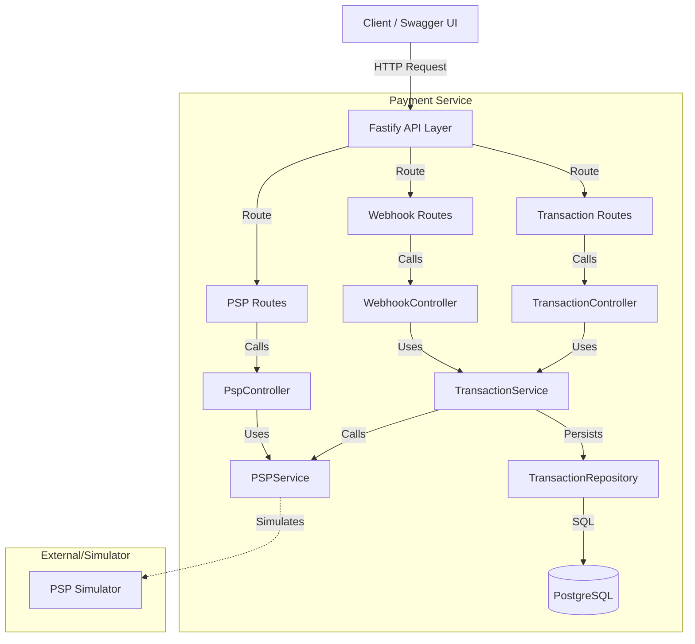

# Payment Integration Service

A robust Fastify-based API designed to handle card transactions and integrate with a mock Payment Service Provider (PSP). This service demonstrates core payment processing flows including successful charges, declined transactions, and 3DS authentication requirements, all while maintaining clean architecture principles.

## Features

- **Transaction Processing**: Securely create transactions and persist them in a PostgreSQL database.
- **PSP Simulation**: Built-in simulator attempting to mimic real-world payment gateway behaviors (Success, Failed, 3DS flows).
- **Asynchronous Webhooks**: Handles PSP callbacks to update transaction statuses in real-time.
- **Resilient Architecture**: Implements a layered architecture (Controller, Service, Repository) with Dependency Injection.
- **Swagger Documentation**: Interactive API documentation available at `/docs`.
- **Automated Testing**: Includes unit and integration tests using Vitest.

## Prerequisites

Ensure you have the following installed on your machine:

- **Node.js** (v18 or higher)
- **Docker & Docker Compose**
- **Git**

## Setup & Installation

1. **Clone the Repository**

   ```bash
   git clone <repository-url>
   cd payment-service
   ```

2. **Install Dependencies**

   ```bash
   npm install
   ```

3. **Environment Configuration**
   The application comes with a default `.env` file. Modify it if you need custom configurations.

4. **Start the Application**
   This command starts the containerized PostgreSQL database and runs database migrations.
   Only for the first time.

   ```bash
   npm run dev:setup
   ```

5. **Run the Development Server**
   ```bash
   npm run dev
   ```
   The server will start at `http://localhost:3000`.

## Testing Transactions

We provide a handy batch file to quickly test different transaction scenarios.

### Using the Batch File (Windows)

1. Open a terminal in the project root.
2. Run the batch file:
   ```bash
   .\create_transactions.bat
   ```
   _Note: If running from Git Bash or similar, use `./create_transactions.bat`._

This script executes three `curl` commands corresponding to the scenarios below:

### Manual Testing Scenarios

Use specific card number prefixes to trigger different outcomes:

| Card Number Prefix | Scenario         | Expected Outcome                               |
| ------------------ | ---------------- | ---------------------------------------------- |
| `5555...`          | **Success**      | Transaction is approved immediately.           |
| `4000...`          | **Failed**       | Transaction is declined by the PSP.            |
| `4111...`          | **3DS Required** | Transaction requires 3D Secure authentication. |

## API Reference

### 1. Create Transaction

Initiates a payment.

- **Endpoint**: `POST /transactions`
- **Body**:
  ```json
  {
    "amount": 1000,
    "currency": "EUR",
    "cardNumber": "5555000000000000",
    "cardExpiry": "12/25",
    "cvv": "123",
    "orderId": "ord_123"
  }
  ```

**Curl Example:**

```bash
curl -X POST http://localhost:3000/transactions ^
  -H "Content-Type: application/json" ^
  -d "{\"amount\": 1000, \"currency\": \"EUR\", \"cardNumber\": \"5555000000000000\", \"cardExpiry\": \"12/25\", \"cvv\": \"123\"}"
```

### 2. Webhook Callback

Updates the status of a transaction.

- **Endpoint**: `POST /webhooks/psp`
- **Body**:
  ```json
  {
    "transactionId": "tx_123456",
    "status": "SUCCESS"
  }
  ```

**Curl Example:**

```bash
curl -X POST http://localhost:3000/webhooks/psp ^
  -H "Content-Type: application/json" ^
  -d "{\"transactionId\": \"tx_123456\", \"status\": \"SUCCESS\"}"
```

### 3. Swagger UI

Visit [http://localhost:3000/docs](http://localhost:3000/docs) to explore the full API documentation interactively.

## Architecture

The application follows a clean, layered architecture to ensure separation of concerns and testability.

### High-Level Overview



### Key Components

1.  **Transport Layer (API)**:
    - **Routes**: Define endpoints and request validation (using JSON Schema).
    - **Controllers**: Handle HTTP requests, parse inputs, and invoke business logic.

2.  **Application Layer (Services)**:
    - **TransactionService**: Orchestrates the payment flow, handles logic, and manages state transitions.
    - **PSPService**: Abstraction layer for communicating with the Payment Service Provider.

3.  **Infrastructure Layer**:
    - **Repositories**: Direct data access objects (DAOs) for interacting with PostgreSQL.
    - **Plugins**: encapsulating external dependencies like Database connections and Swagger.

4.  **Domain Layer**:
    - Contains enums and types (e.g., `TransactionStatus`, `Currency`) shared across layers.
    - In real application it will contain business logic and rules.

## Decisions & Rationale

- **Fastify**: Chosen for its high performance and low overhead compared to Express.
- **Dependency Injection**: We use standard constructor injection to wire components (Repo -> Service -> Controller), making the system modular and easy to unit test.
- **PostgreSQL**: A robust relational database suitable for transactional data with ACID properties.
- **Docker Compose**: Simplifies the development environment setup by bundling the app and database together.
